# ✈️ Sistema de Gerenciamento de Aviação Comercial

**Projeto acadêmico — Oficina de Integração de Software**  
Aplicação desktop em Java com persistência MariaDB, desenvolvida do zero sob **Personal Scrum** (Scrum adaptado para 1 desenvolvedor).

> [🔗 Repositório](https://github.com/felipecarzo/ibmr-oficina-sistema-aviacao-26) &nbsp;|&nbsp; [📦 Download ZIP](https://github.com/felipecarzo/ibmr-oficina-sistema-aviacao-26/archive/refs/heads/main.zip)

---

## 📋 Índice

- [Visão do Produto](#-visão-do-produto)
- [Stack Tecnológica](#-stack-tecnológica)
- [Casos de Uso](#-casos-de-uso)
- [Arquitetura](#-arquitetura)
- [Modelo Relacional](#-modelo-relacional)
- [Diagrama de Classes](#-diagrama-de-classes)
- [Diagramas de Sequência](#-diagramas-de-sequência)
- [Regras de Negócio](#-regras-de-negócio)
- [Estrutura do Projeto](#-estrutura-do-projeto)
- [Interface Gráfica](#-interface-gráfica)
- [Sprints (Personal Scrum)](#-sprints-personal-scrum)
- [Tratamento de Erros](#-tratamento-de-erros)
- [Como Executar](#-como-executar)
- [Portabilidade Windows](#-portabilidade-windows)
- [Documentação](#-documentação)

---

## 🎯 Visão do Produto

**Para** administradores e atendentes de companhias aéreas que precisam gerenciar operações de aviação comercial,  
**o** Sistema de Gerenciamento de Aviação Comercial **é um** aplicativo desktop em Java  
**que** permite cadastrar e consultar aeronaves, companhias aéreas, aeroportos, passageiros, voos e reservas,  
**diferente de** planilhas ou sistemas genéricos,  
**o nosso produto** oferece persistência real em banco relacional com integridade referencial garantida.

### Stakeholders

| Papel | Descrição |
| :--- | :--- |
| **Professor** | Cliente / Avaliador — valida o MVP |
| **Felipe (Dev)** | Único desenvolvedor, Product Owner, Scrum Master |
| **Colegas (equipe Python)** | Referência de ritmo e progresso |

### Definição de Pronto (DoD)

- ✅ **Persistência Real:** Toda operação reflete imediatamente no banco
- ✅ **Fail-Safe:** Exceções capturadas com mensagens amigáveis — o sistema nunca "quebra"
- ✅ **Recursos Fechados:** Toda conexão JDBC usa `try-with-resources`
- ✅ **Compilação Limpa:** `mvn clean compile` sem erros
- ✅ **Portabilidade Windows:** Roda ao importar no Eclipse sem adaptações

---

## 🛠 Stack Tecnológica

| Camada | Tecnologia |
| :--- | :--- |
| Linguagem | Java 17+ |
| Interface | Java Swing (GUI) — zero dependências externas |
| Build | Apache Maven |
| Banco | MariaDB 10.4+ (XAMPP) |
| Conectividade | JDBC com `mysql-connector-j` |
| Admin DB | phpMyAdmin |
| IDE | Eclipse IDE (Windows) / VS Code ou terminal (Linux) |
| Metodologia | Personal Scrum |

---

## 📊 Casos de Uso

O sistema possui **8 casos de uso** organizados em 2 épicos:

### Épico 1 — Gerenciamento de Entidades Base

| ID | Nome | Ator | US vinculadas |
| :--- | :--- | :--- | :--- |
| UC-01 | Gerenciar Aeronaves | Administrador | US-01 a US-05 |
| UC-02 | Gerenciar Companhias Aéreas | Administrador | US-06 |
| UC-03 | Gerenciar Aeroportos | Administrador | US-07 |
| UC-04 | Gerenciar Passageiros | Administrador / Atendente | US-08 |

### Épico 2 — Operações de Voo e Reserva

| ID | Nome | Ator | US vinculadas |
| :--- | :--- | :--- | :--- |
| UC-05 | Gerenciar Voos | Administrador | US-09, US-10 |
| UC-06 | Vincular Aeronave a Companhia | Administrador | US-11 |
| UC-07 | Efetuar Reserva | Atendente | US-12, US-14 |
| UC-08 | Cancelar Reserva | Atendente | US-13 |

### Diagrama de Casos de Uso

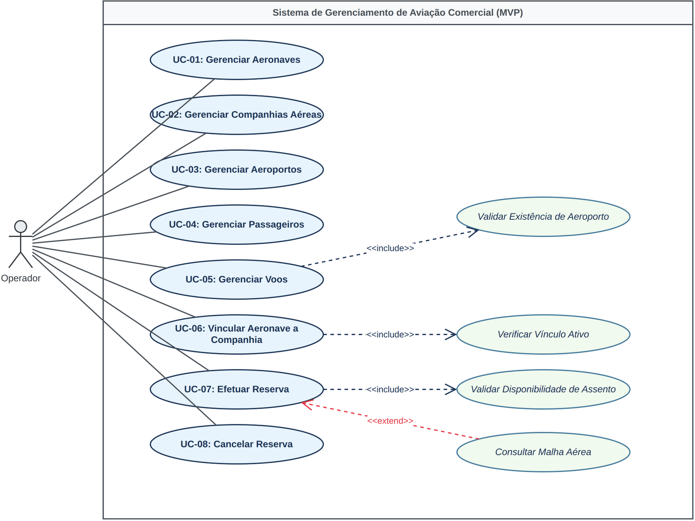

---

## 🏗 Arquitetura

O sistema segue o padrão **DAO / Service / GUI** em 4 camadas:

```
 ┌─────────────────────────────────────┐
 │         Interface do Usuário        │  ← Java Swing (GUI)
 ├─────────────────────────────────────┤
 │           Camada de Serviço         │  ← Validador.java (regras de negócio)
 ├─────────────────────────────────────┤
 │     Camada DAO (Data Access Object)  │  ← SQL + JDBC + ConnectionFactory
 ├─────────────────────────────────────┤
 │         Banco de Dados MariaDB      │  ← sistema_aviacao
 └─────────────────────────────────────┘
```

**Fluxo de chamada:**

```
[GUI/Swing] → [Service/Validador] → [DAO] → [ConnectionFactory] → [MariaDB]
```

### Padrões de Projeto

| Padrão | Onde | Por quê |
| :--- | :--- | :--- |
| **Singleton** | `ConnectionFactory` | Uma única instância gerencia todas as conexões JDBC |
| **DAO** | `PassageiroDAO`, `AeronaveDAO`, etc | Cada entidade tem sua classe de acesso a dados |
| **POJO** | `Passageiro`, `Aeronave`, etc | Modelos simples com atributos, getters e setters |

---

## 💾 Modelo Relacional

O banco possui **7 tabelas** com integridade referencial garantida via chaves estrangeiras:

```
 ┌──────────────┐     ┌──────────────────┐     ┌──────────────┐
 │   aeronave   │────<│   aeronave_cia   │>────│   cia_aerea  │
 └──────────────┘     └──────────────────┘     └──────────────┘
                                                         │
 ┌──────────────┐     ┌──────────────┐                  │
 │  passageiro  │────<│   reserva    │>────┐             │
 └──────────────┘     └──────────────┘     │             │
                                            │             │
 ┌──────────────┐     ┌──────────────┐     │             │
 │  aeroporto   │────<│     voo      │─────┘             │
 └──────────────┘     └──────────────┘
```

### Dicionário de Dados

| Tabela | Descrição | PK | FK |
| :--- | :--- | :--- | :--- |
| `aeronave` | Aeronaves cadastradas | `id_aeronave` | — |
| `cia_aerea` | Companhias aéreas | `id_cia` | — |
| `aeronave_cia` | Vínculo aeronave ↔ companhia | `id_aeronave` + `id_cia` | `id_aeronave`, `id_cia` |
| `aeroporto` | Aeroportos | `cod_aeroporto` | — |
| `passageiro` | Passageiros | `id_passageiro` | — |
| `voo` | Voos | `cod_voo` | `cod_aeroporto` |
| `reserva` | Reservas | `cod_reserva` | `id_passageiro`, `cod_voo` |

---

## 🧬 Diagrama de Classes

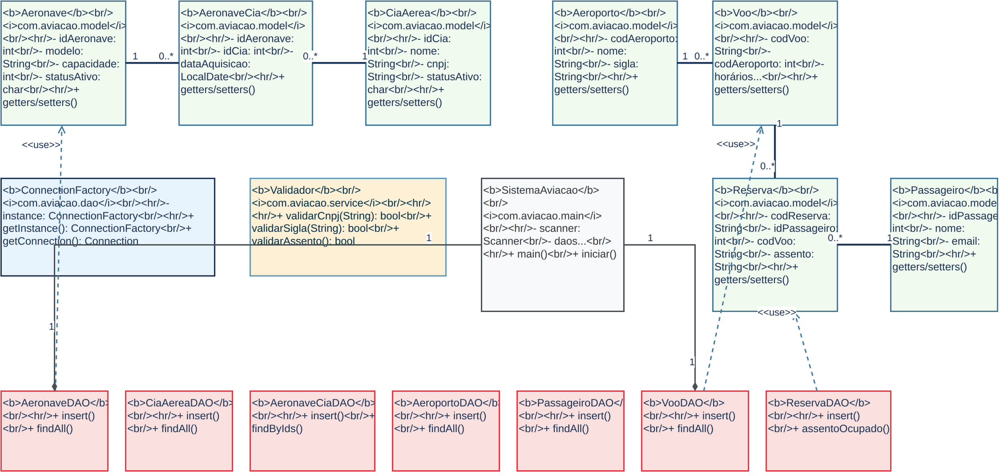

O diagrama completo em Mermaid está disponível em [`docs/class-diagram.md`](docs/class-diagram.md).

---

## 🔄 Diagramas de Sequência

### UC-01 — Gerenciar Aeronaves

| Fluxo | Diagrama |
| :--- | :---: |
| Consulta Geral | 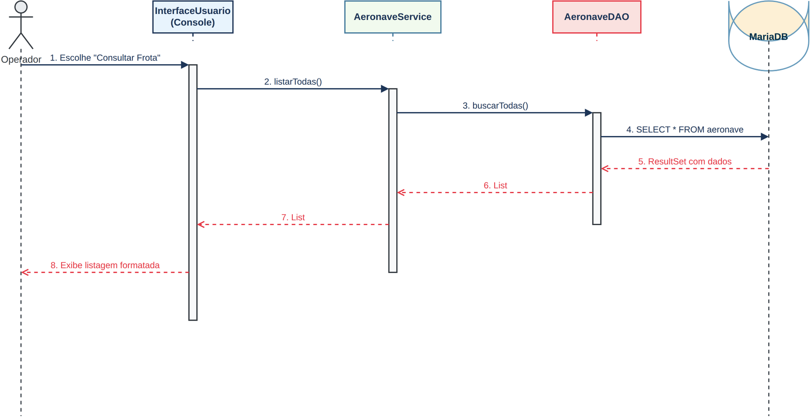 |
| Cadastro | 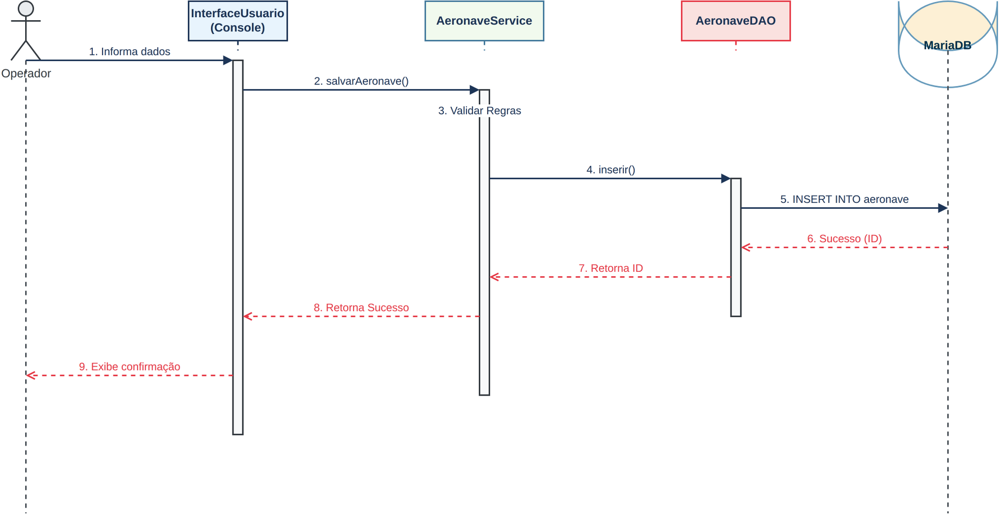 |

### UC-02 — Gerenciar Companhias

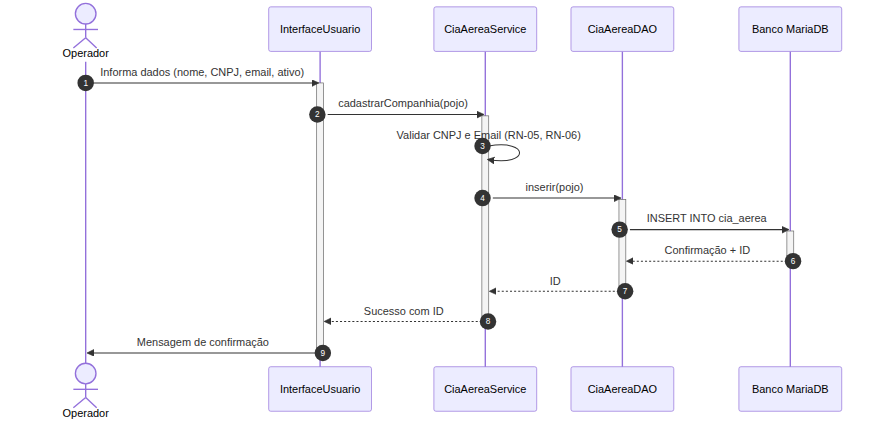

### UC-03 — Gerenciar Aeroportos

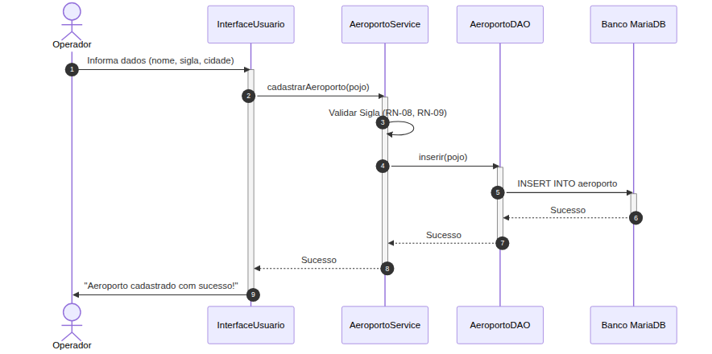

### UC-04 — Gerenciar Passageiros

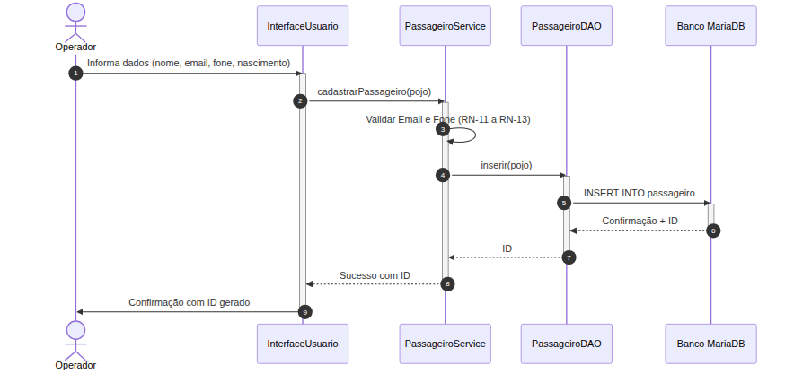

### UC-05 — Gerenciar Voos

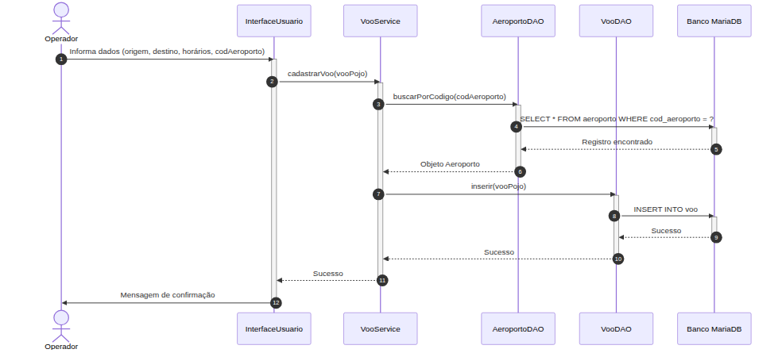

### UC-06 — Vincular Aeronave a Companhia

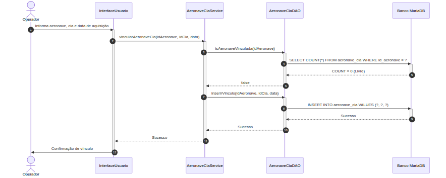

### UC-07 — Efetuar Reserva

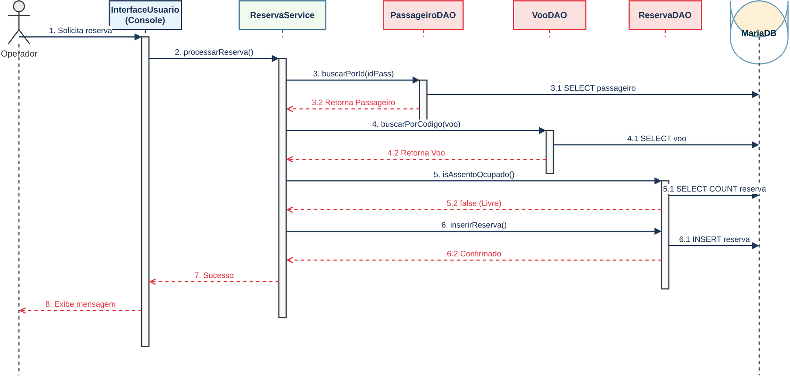

### UC-08 — Cancelar Reserva

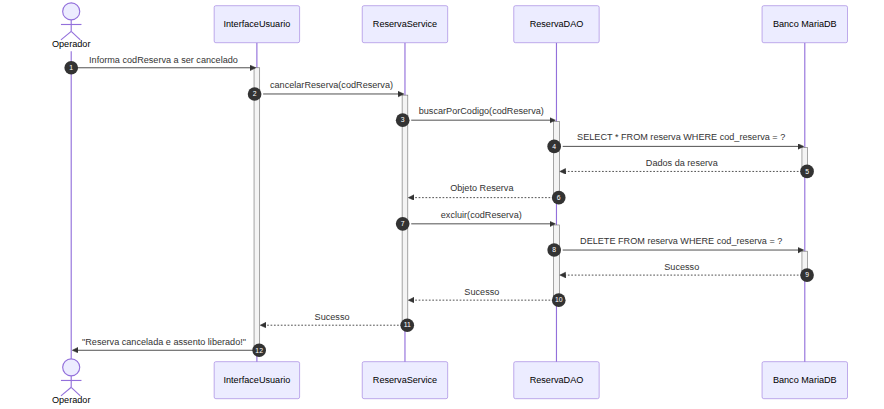

---

## 📜 Regras de Negócio

21 regras de negócio documentadas e implementadas:

| RN | Descrição | UC |
| :--- | :--- | :--- |
| RN-01 | Capacidade da aeronave: 1 a 999 | UC-01 |
| RN-02 | Envergadura: inteiro positivo | UC-01 |
| RN-03 | Status ativo: 'S' ou 'N' | UC-01 |
| RN-04 | Modelo único por fabricante (não obrigatório no MVP) | UC-01 |
| RN-05 | CNPJ: 14 dígitos numéricos | UC-02 |
| RN-06 | E-mail: deve conter '@' e domínio | UC-02 |
| RN-07 | Cia com aeronaves vinculadas não pode ser excluída | UC-02 |
| RN-08 | Sigla do aeroporto: 3 letras | UC-03 |
| RN-09 | Sigla do aeroporto: única | UC-03 |
| RN-10 | Aeroporto com voos vinculados não pode ser excluído | UC-03 |
| RN-11 | Data de nascimento não futura | UC-04 |
| RN-12 | E-mail do passageiro: único | UC-04 |
| RN-13 | Telefone: 10-11 dígitos com DDD | UC-04 |
| RN-14 | Horário de chegada > partida | UC-05 |
| RN-15 | Código do voo: 2 letras + 4 dígitos | UC-05 |
| RN-16 | Origem ≠ destino | UC-05 |
| RN-17 | Aeronave: 1 vínculo ativo por vez | UC-06 |
| RN-18 | Data de aquisição não futura | UC-06 |
| RN-19 | Assento: 1 reserva ativa por voo | UC-07 |
| RN-20 | Código da reserva: único | UC-07 |
| RN-21 | Data da reserva não anterior à atual | UC-07 |

---

## 📁 Estrutura do Projeto

```
sistema-aviacao/
├── pom.xml                              → Maven (Java 17 + mysql-connector-j)
├── setup.ps1                            → Auto-instalação Windows
├── SETUP_WINDOWS.md                     → Guia de instalação manual
├── README.md                            → Este documento
│
├── src/main/java/com/aviacao/
│   ├── main/
│   │   └── SistemaAviação.java          → Entry point console (legado)
│   │
│   ├── gui/                             → ★ Interface Gráfica (Swing)
│   │   ├── MainFrame.java               →   JFrame com 7 abas
│   │   ├── CrudPanel.java               →   Painel CRUD reutilizável
│   │   ├── FormDialog.java              →   Formulário modal dinâmico
│   │   └── CampoFormulario.java         →   Descritor de campo
│   │
│   ├── service/
│   │   └── Validador.java               → Validações de domínio
│   │
│   ├── model/                           → ★ 7 POJOs
│   │   ├── Aeronave.java
│   │   ├── CiaAerea.java
│   │   ├── AeronaveCia.java
│   │   ├── Aeroporto.java
│   │   ├── Passageiro.java
│   │   ├── Voo.java
│   │   └── Reserva.java
│   │
│   └── dao/                             → ★ 7 DAOs + ConnectionFactory
│       ├── ConnectionFactory.java       →   Singleton JDBC
│       ├── AeronaveDAO.java
│       ├── CiaAereaDAO.java
│       ├── AeronaveCiaDAO.java
│       ├── AeroportoDAO.java
│       ├── PassageiroDAO.java
│       ├── VooDAO.java
│       └── ReservaDAO.java
│
├── docs/                                → Documentação completa
│   ├── vision.md                        → Product Vision
│   ├── product-backlog.md               → Product Backlog (MoSCoW)
│   ├── use-cases.md                     → 8 casos de uso
│   ├── technical-design.md              → Arquitetura + DER
│   ├── class-diagram.md                 → Diagrama de classes (Mermaid)
│   ├── sprint-backlog.md                → Status das sprints
│   ├── GOD_BACKLOG.md                   → Checklist completo
│   ├── sistema_aviacao.sql              → Dump do banco (+ dados)
│   ├── legacy/                          → Documentos originais
│   └── images/                          → 11 diagramas PNG
│       ├── diagrama-casos-de-uso.png
│       ├── diagrama-classes-uml.png
│       ├── seq-consulta-geral-aeronaves.png
│       ├── seq-cadastro-aeronave.png
│       ├── seq-cadastro-companhia.png
│       ├── seq-cadastro-aeroporto.png
│       ├── seq-cadastro-passageiro.png
│       ├── seq-cadastro-voo.png
│       ├── seq-vincular-aeronave-cia.png
│       ├── seq-efetuar-reserva.png
│       └── seq-cancelar-reserva.png
│
└── src/main/resources/
    └── db.properties                    → Credenciais do banco
```

---

## 🖥 Interface Gráfica

A interface substitui o console como camada de apresentação, usando **Java Swing** (nativo do JDK).

### Componentes

| Classe | Função |
| :--- | :--- |
| `MainFrame` | JFrame principal com JTabbedPane (7 abas) |
| `CrudPanel` | JPanel reutilizável com JTable + CRUD |
| `FormDialog` | JDialog modal com formulários dinâmicos |
| `CampoFormulario` | Descritor de campo (rótulo, tipo, validador) |

### Fluxo da GUI

```
MainFrame (abertura)
  → JTabbedPane
    → CrudPanel (entidade)
      → JTable (dados via DAO)
      → FormDialog (inserir/editar)
        → campos validados → DAO → banco
```

### Abas Implementadas

| Aba | Operações |
| :--- | :--- |
| Aeronaves | Cadastrar, Editar, Excluir, Buscar ID, Listar |
| Companhias | Cadastrar (c/ validação CNPJ/email), Editar, Excluir |
| Aeroportos | Cadastrar (c/ validação sigla), Editar, Excluir |
| Passageiros | Cadastrar (c/ validação email/tel/data), Editar, Excluir |
| Voos | Cadastrar (c/ validação horário), Editar, Excluir, Buscar rota |
| Vínculo Aero-Cia | Vincular/Desvincular aeronave a companhia |
| Reservas | Efetuar (c/ verificação assento), Editar assento, Cancelar |

---

## 🧪 Tratamento de Erros

Todas as operações críticas possuem tratamento de exceções com feedback visual:

| Cenário | Comportamento |
| :--- | :--- |
| MySQL desligado | Mensagem: *"Verifique se o XAMPP/MySQL está rodando em localhost:3306"* |
| FK violada (exclusão) | Mensagem: *"Não foi possível excluir. Pode haver vínculos ativos."* |
| Assento já reservado | Mensagem: *"Assento já ocupado."* |
| CNPJ/Email inválido | Validação no formulário antes de enviar ao banco |
| Sucesso na operação | *"Cadastrado com sucesso! ID: X"* |

---

## 📋 Sprints (Personal Scrum)

O projeto foi dividido em **8 sprints**, seguindo Personal Scrum:

| Sprint | Foco | Entregas |
| :--- | :--- | :--- |
| **Sprint 0** — Inception | Docs + Diagramas | Vision, Backlog, Use Cases, 11 diagramas PNG |
| **Sprint A** — Setup | Maven + BD | `pom.xml`, `ConnectionFactory`, `db.properties` |
| **Sprint B** — POJOs/DAOs I | Entidades independentes | Passageiro, Aeroporto, CiaAerea |
| **Sprint C** — POJOs/DAOs II | Entidades dependentes | Aeronave, AeronaveCia, Voo, Reserva |
| **Fase 5.4** — Service | Validador | `Validador.java` (9 validações) |
| **Sprint D** — Menu console | Interface textual | `SistemaAviação.java` (menu navegável) |
| **Sprint E** — Portabilidade | Windows/Eclipse | `SETUP_WINDOWS.md`, ZIP, encoding UTF-8 |
| **Sprint F** — GUI | Java Swing | `MainFrame`, `CrudPanel`, `FormDialog` |

---

## 🚀 Como Executar

### Opção 1 — Setup automático (Windows)

Execute como **Administrador**:

```powershell
.\setup.ps1
```

O script:
1. Verifica/instala JDK 17, Maven e XAMPP via `winget`
2. Sobe o MySQL
3. Cria a database `sistema_aviacao`
4. Importa os dados de exemplo
5. Compila e pergunta se quer iniciar

### Opção 2 — Manual (Windows / Linux)

```bash
# 1. Criar o banco
mysql -u root -e "CREATE DATABASE IF NOT EXISTS sistema_aviacao"
mysql -u root sistema_aviacao < docs/sistema_aviacao.sql

# 2. Compilar
mvn clean compile

# 3. Executar (GUI)
mvn exec:java
```

### Opção 3 — Eclipse

1. File → Import → Maven → Existing Maven Projects
2. Selecionar a pasta do projeto
3. Abrir `src/main/java/com/aviacao/gui/MainFrame.java`
4. Botão direito → Run As → Java Application

---

## 🔌 Portabilidade Windows

O projeto foi desenvolvido em Linux e testado para rodar no Windows da faculdade sem adaptações:

| Item | Status |
| :--- | :---: |
| String de conexão JDBC | `localhost:3306` (idêntico em ambos SOs) |
| Resource loading | `getClass().getClassLoader().getResourceAsStream()` |
| Encoding | UTF-8 configurado no `pom.xml` |
| Exec-maven-plugin | `file.encoding=UTF-8` como system property |
| Eclipse | `.project` + `.classpath` incluídos no repositório |

---

## 📚 Documentação

Toda a documentação técnica está em `docs/` no formato Markdown:

| Documento | Conteúdo |
| :--- | :--- |
| [`vision.md`](docs/vision.md) | Propósito, stakeholders, definição de pronto |
| [`product-backlog.md`](docs/product-backlog.md) | 14 user stories, 8 casos de uso, 21 RNs, MoSCoW |
| [`use-cases.md`](docs/use-cases.md) | Especificação formal dos 8 UCs com fluxos e diagramas |
| [`technical-design.md`](docs/technical-design.md) | Arquitetura, DER, mapa de armadilhas comuns |
| [`class-diagram.md`](docs/class-diagram.md) | Diagrama de classes UML em Mermaid |
| [`sprint-backlog.md`](docs/sprint-backlog.md) | Status de todas as sprints |
| [`GOD_BACKLOG.md`](docs/GOD_BACKLOG.md) | Checklist completo do início ao fim |
| [`sistema_aviacao.sql`](docs/sistema_aviacao.sql) | Dump do banco com 10 registros por tabela |

### Diagramas

11 diagramas em PNG na pasta [`docs/images/`](docs/images/):

- Diagrama de casos de uso
- Diagrama de classes UML
- 9 diagramas de sequência (um por fluxo principal)

---

## 👨‍💻 Autor

**Felipe Carzo** — Desenvolvimento full-stack, documentação, diagramação e gestão do projeto (Personal Scrum).

[](https://linkedin.com/in/felipecarzo)

---

> Projeto acadêmico — Oficina de Integração de Software • IBM-Rio • 2026
