```mermaid
classDiagram
    direction TB

    class Aeronave {
        -int idAeronave
        -String modelo
        -int capacidade
        -int envergadura
        -String fabricante
        -char statusAtivo
        +Aeronave()
        +getters_setters()
        +toString() String
    }

    class CiaAerea {
        -int idCia
        -String nome
        -String cnpj
        -String email
        -char statusAtivo
        +CiaAerea()
        +getters_setters()
        +toString() String
    }

    class AeronaveCia {
        -int idAeronave
        -int idCia
        -LocalDate dataAquisicao
        +AeronaveCia()
        +getters_setters()
        +toString() String
    }

    class Aeroporto {
        -int codAeroporto
        -String nome
        -String sigla
        -String cidade
        +Aeroporto()
        +getters_setters()
        +toString() String
    }

    class Passageiro {
        -int idPassageiro
        -String nome
        -String email
        -String tel
        -LocalDate dtNasc
        +Passageiro()
        +getters_setters()
        +toString() String
    }

    class Voo {
        -String codVoo
        -int horaPartida
        -int horaChegada
        -int codAeroporto
        -String cidadeOrigem
        -String cidadeDestino
        +Voo()
        +getters_setters()
        +toString() String
    }

    class Reserva {
        -String codReserva
        -int idPassageiro
        -String codVoo
        -String assento
        -LocalDate dtReserva
        +Reserva()
        +getters_setters()
        +toString() String
    }

    class ConnectionFactory {
        -ConnectionFactory instance$
        -String url
        -String user
        -String password
        -ConnectionFactory()
        +getInstance() ConnectionFactory$
        +getConnection() Connection
        +close(Connection) void
        +close(Connection, PreparedStatement, ResultSet) void
    }

    class Validador {
        +validarCnpj(String) boolean$
        +validarEmail(String) boolean$
        +validarSigla(String) boolean$
        +validarTelefone(String) boolean$
        +validarDataNascimento(LocalDate) boolean$
        +validarCapacidade(int) boolean$
        +validarHorario(int) boolean$
        +validarStatusAtivo(char) boolean$
        +validarAssento(String) boolean$
    }

    class SistemaAviacao {
        -Scanner scanner
        -AeronaveDAO aeronaveDAO
        -CiaAereaDAO ciaAereaDAO
        -AeroportoDAO aeroportoDAO
        -PassageiroDAO passageiroDAO
        -AeronaveCiaDAO aeronaveCiaDAO
        -VooDAO vooDAO
        -ReservaDAO reservaDAO
        +main(String[] args)$
        +iniciar() void
        -exibirMenu() void
        -gerenciarAeronaves() void
        -gerenciarCompanhias() void
        -gerenciarAeroportos() void
        -gerenciarPassageiros() void
        -gerenciarVoos() void
        -vincularAeronaveCia() void
        -efetuarReserva() void
        -cancelarReserva() void
    }

    class AeronaveDAO {
        -ConnectionFactory cf
        +findById(int id) Aeronave
        +findAll() List~Aeronave~
        +insert(Aeronave a) void
        +update(Aeronave a) void
        +delete(int id) void
    }

    class CiaAereaDAO {
        -ConnectionFactory cf
        +findById(int id) CiaAerea
        +findAll() List~CiaAerea~
        +insert(CiaAerea c) void
        +update(CiaAerea c) void
        +delete(int id) void
    }

    class AeronaveCiaDAO {
        -ConnectionFactory cf
        +findByIds(int idAeronave, int idCia) AeronaveCia
        +findAll() List~AeronaveCia~
        +findByAeronave(int idAeronave) List~AeronaveCia~
        +findByCia(int idCia) List~AeronaveCia~
        +insert(AeronaveCia ac) void
        +delete(int idAeronave, int idCia) void
    }

    class AeroportoDAO {
        -ConnectionFactory cf
        +findById(int id) Aeroporto
        +findAll() List~Aeroporto~
        +insert(Aeroporto a) void
        +update(Aeroporto a) void
        +delete(int id) void
    }

    class PassageiroDAO {
        -ConnectionFactory cf
        +findById(int id) Passageiro
        +findAll() List~Passageiro~
        +insert(Passageiro p) void
        +update(Passageiro p) void
        +delete(int id) void
    }

    class VooDAO {
        -ConnectionFactory cf
        +findById(String codVoo) Voo
        +findAll() List~Voo~
        +insert(Voo v) void
        +update(Voo v) void
        +delete(String codVoo) void
        +findByOrigem(String cidade) List~Voo~
        +findByDestino(String cidade) List~Voo~
    }

    class ReservaDAO {
        -ConnectionFactory cf
        +findById(String codReserva) Reserva
        +findAll() List~Reserva~
        +insert(Reserva r) void
        +delete(String codReserva) void
        +findByVoo(String codVoo) List~Reserva~
        +findByPassageiro(int idPassageiro) List~Reserva~
        +assentoOcupado(String codVoo, String assento) boolean
    }

    %% Relacionamentos entre modelos
    Aeronave "1" -- "0..*" AeronaveCia : possui histórico
    CiaAerea "1" -- "0..*" AeronaveCia : opera
    Aeroporto "1" -- "0..*" Voo : origem/destino
    Voo "1" -- "0..*" Reserva : contém
    Passageiro "1" -- "0..*" Reserva : realiza

    %% DAOs usam Models
    AeronaveDAO ..> Aeronave : <<use>>
    CiaAereaDAO ..> CiaAerea : <<use>>
    AeronaveCiaDAO ..> AeronaveCia : <<use>>
    AeroportoDAO ..> Aeroporto : <<use>>
    PassageiroDAO ..> Passageiro : <<use>>
    VooDAO ..> Voo : <<use>>
    ReservaDAO ..> Reserva : <<use>>

    %% DAOs usam ConnectionFactory
    AeronaveDAO ..> ConnectionFactory : <<use>>
    CiaAereaDAO ..> ConnectionFactory : <<use>>
    CiaAereaDAO ..> ConnectionFactory : <<use>>
    AeronaveCiaDAO ..> ConnectionFactory : <<use>>
    AeroportoDAO ..> ConnectionFactory : <<use>>
    PassageiroDAO ..> ConnectionFactory : <<use>>
    VooDAO ..> ConnectionFactory : <<use>>
    ReservaDAO ..> ConnectionFactory : <<use>>

    %% Composição do Controlador
    SistemaAviacao *-- AeronaveDAO : <<compose>>
    SistemaAviacao *-- CiaAereaDAO : <<compose>>
    SistemaAviacao *-- AeroportoDAO : <<compose>>
    SistemaAviacao *-- PassageiroDAO : <<compose>>
    SistemaAviacao *-- AeronaveCiaDAO : <<compose>>
    SistemaAviacao *-- VooDAO : <<compose>>
    SistemaAviacao *-- ReservaDAO : <<compose>>
    SistemaAviacao ..> Validador : <<use>>
```

# Diagrama de Classes UML

> Diagrama inline (Mermaid) com todas as classes do sistema, atributos, métodos e relacionamentos.

```
┌───────────────────────────────────────────────────────────────────────────────┐
│  Modelos │ DAOs │ ConnectionFactory │ Validador │ SistemaAviação               │
└───────────────────────────────────────────────────────────────────────────────┘
```


