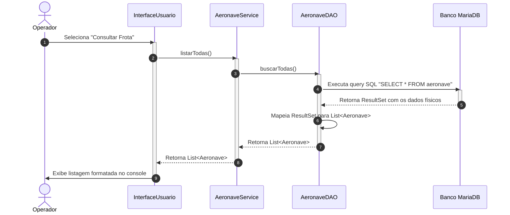
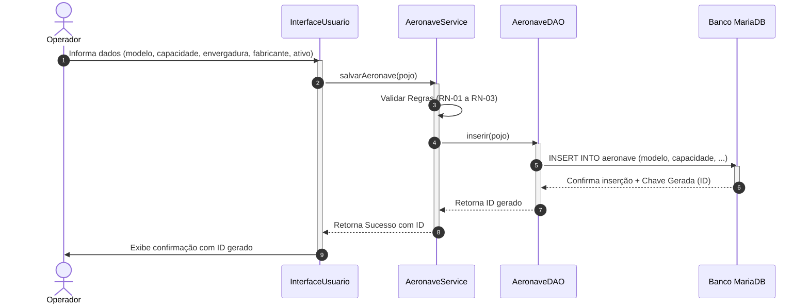
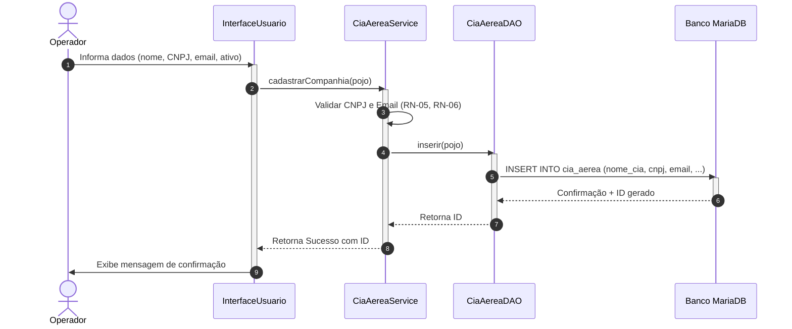
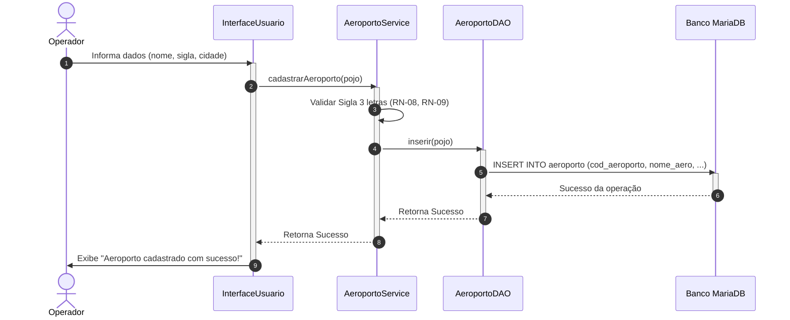
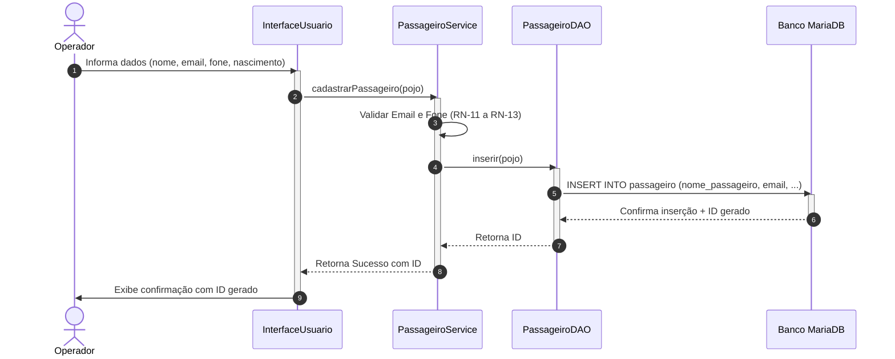
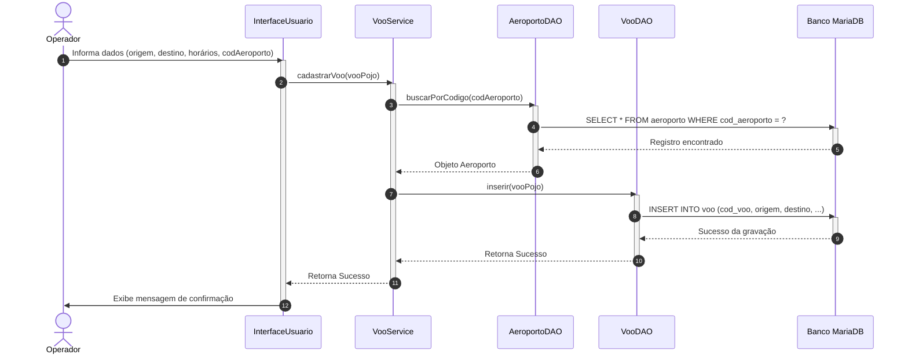
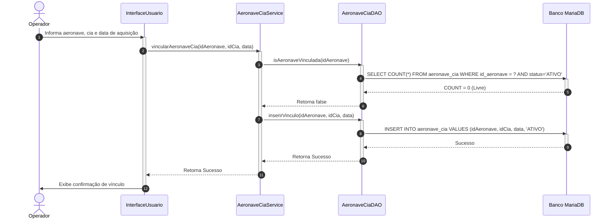
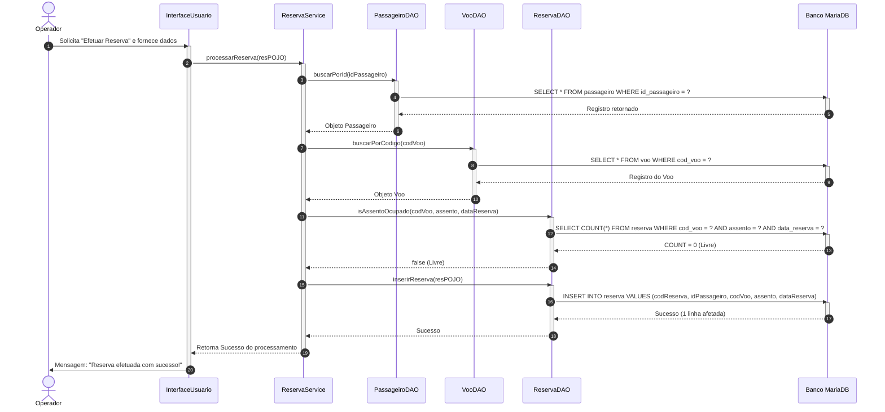
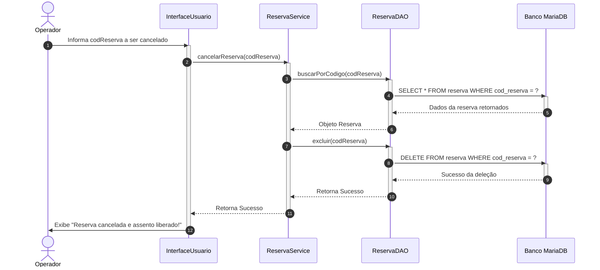

# Documento de Especificação de Casos de Uso e Diagramas de Sequência (UML)
## Sistema de Gerenciamento de Aviação Comercial (MVP)

> [!TIP]
> **🚀 Recursos Visuais Editáveis Criados:**
> Além dos diagramas interativos renderizados em Markdown abaixo, foi criado um arquivo multi-páginas profissional compatível com o **Draw.io (Diagrams.net)** contendo todas as modelagens UML do projeto:
> * **Localização do arquivo no projeto:** [diagramas_mvp.drawio](file:///home/felipe/Projetos/Estudo/proj_sistemaAviacao/docs/diagramas_mvp.drawio)
> * **Como utilizar:** Basta acessar [app.diagrams.net](https://app.diagrams.net/), clicar em **"Abrir Diagrama Existente"** (ou arrastar e soltar o arquivo na tela) e importar este arquivo. O arquivo possui abas separadas para o **Diagrama de Casos de Uso** e cada um dos **9 Diagramas de Sequência**, totalmente editáveis e formatados em **A4 Horizontal (Landscape)** com fundos claros de alto contraste!

Este documento apresenta a especificação formal de casos de uso e os diagramas de sequência baseados na Unified Modeling Language (UML) para todos os casos de uso definidos no Roadmap do Sistema de Gerenciamento de Aviação Comercial.

---

## 1. Visão Geral dos Atores e Arquitetura

Para o escopo do MVP, os papéis de *Administrador* e *Atendente* são unificados sob o ator genérico **Operador**, que interage com o sistema por meio de uma interface em modo texto (Console/Menu) ou Swing.

A arquitetura do software segue o padrão MVC/Service-DAO de três camadas sobre o banco de dados relacional MariaDB:
1. **Camada de Interface (View/Console):** Responsável pela interação direta com o operador (captura de inputs, renderização de menus e dados).
2. **Camada de Serviço (Service):** Detentora das regras de negócio, validações e tratamento lógico antes da persistência.
3. **Camada de Acesso a Dados (DAO - Data Access Object):** Responsável por encapsular as queries SQL e a conectividade JDBC com o banco de dados.
4. **Banco de Dados (MariaDB):** Camada física de persistência de dados.

---

## 2. Especificação Formal de Casos de Uso (UML)

Abaixo estão detalhados os casos de uso do sistema, abrangendo operações básicas (CRUD) e transações complexas de negócios.

### UC-01 — Gerenciar Aeronaves

* **Ator Principal:** Operador
* **Objetivo:** Permitir o cadastro, consulta, atualização e desativação lógica de aeronaves no sistema.
* **Pré-condições:** O banco de dados MariaDB deve estar ativo.
* **Fluxo Principal (Cadastro):**
  1. Operador seleciona a opção "Gerenciar Aeronaves" -> "Cadastrar Aeronave".
  2. Sistema solicita os dados da nova aeronave: modelo, capacidade, envergadura, fabricante e status ativo ('S' ou 'N').
  3. Operador digita as informações e confirma.
  4. Sistema (AeronaveService) valida se a capacidade é positiva e entre 1 e 999 (RN-01), envergadura positiva (RN-02) e status válido (RN-03).
  5. Sistema (AeronaveDAO) executa o `INSERT INTO aeronave`.
  6. Sistema exibe mensagem de sucesso com o ID gerado.
* **Fluxo Principal (Consulta Geral):**
  1. Operador escolhe "Gerenciar Aeronaves" -> "Consultar Frota".
  2. Sistema (AeronaveDAO) executa `SELECT * FROM aeronave` no banco.
  3. Sistema recupera a lista de aeronaves e a exibe organizada no console.
* **Pós-condições:** Os dados das aeronaves são salvos e atualizados no banco de dados.

---

### UC-02 — Gerenciar Companhias Aéreas

* **Ator Principal:** Operador
* **Objetivo:** Cadastrar, consultar, atualizar e desativar companhias aéreas.
* **Pré-condições:** Banco de dados ativo.
* **Fluxo Principal (Cadastro):**
  1. Operador seleciona "Cadastrar Companhia Aérea".
  2. Sistema solicita: Nome da Cia, CNPJ, e-mail e status ativo.
  3. Operador informa os dados e confirma.
  4. Sistema (CiaAereaService) valida se o CNPJ tem 14 dígitos (RN-05) e se o e-mail é válido (RN-06).
  5. Sistema (CiaAereaDAO) executa o `INSERT INTO cia_aerea`.
  6. Sistema exibe confirmação de cadastro com o ID da companhia.
* **Regras de Negócio:**
  * **RN-05:** O CNPJ deve conter exatamente 14 dígitos numéricos (sem formatação).
  * **RN-06:** O e-mail deve conter '@' e domínio de formato válido.
  * **RN-07:** Companhias com vínculos ativos de aeronaves não podem ser excluídas fisicamente do banco.

---

### UC-03 — Gerenciar Aeroportos

* **Ator Principal:** Operador
* **Objetivo:** Cadastrar, consultar, atualizar e excluir aeroportos de pouso e decolagem.
* **Pré-condições:** Banco de dados ativo.
* **Fluxo Principal (Cadastro):**
  1. Operador escolhe "Cadastrar Aeroporto".
  2. Sistema solicita: Nome do aeroporto, sigla (3 letras) e cidade correspondente.
  3. Operador digita e envia.
  4. Sistema (AeroportoService) valida se a sigla contém exatamente 3 caracteres alfabéticos (RN-08) e se ela já não existe no banco (RN-09).
  5. Sistema (AeroportoDAO) executa `INSERT INTO aeroporto`.
  6. Sistema exibe mensagem de sucesso.
* **Regras de Negócio:**
  * **RN-08:** A sigla do aeroporto deve conter exatamente 3 caracteres alfabéticos maiúsculos (ex: "GRU", "SDU").
  * **RN-09:** A sigla do aeroporto deve ser exclusiva no sistema.

---

### UC-04 — Gerenciar Passageiros

* **Ator Principal:** Operador
* **Objetivo:** Cadastrar, consultar, atualizar e excluir passageiros da base de clientes da aviação.
* **Pré-condições:** Banco de dados ativo.
* **Fluxo Principal (Cadastro):**
  1. Operador seleciona "Cadastrar Passageiro".
  2. Sistema solicita: Nome do Passageiro, e-mail, telefone e data de nascimento.
  3. Operador insere os dados e confirma.
  4. Sistema (PassageiroService) valida se a data de nascimento não é futura (RN-11), se o e-mail é único (RN-12) e se o telefone contém DDD (RN-13).
  5. Sistema (PassageiroDAO) executa `INSERT INTO passageiro`.
  6. Sistema exibe confirmação e ID gerado.

---

### UC-05 — Gerenciar Voos

* **Ator Principal:** Operador
* **Objetivo:** Registrar voos associando-os a rotas e a um aeroporto de partida cadastrado.
* **Pré-condições:** O aeroporto de partida informado já deve estar cadastrado.
* **Fluxo Principal:**
  1. Operador seleciona "Cadastrar Voo".
  2. Sistema solicita: Código do voo, cidade de origem, destino, horário de partida (HHMM), horário de chegada (HHMM) e o código do aeroporto correspondente.
  3. Operador informa os dados.
  4. Sistema (VooService) valida as regras (RN-14 a RN-16) e consulta a existência do aeroporto pelo `AeroportoDAO`.
  5. Se o aeroporto existir, o sistema (VooDAO) executa `INSERT INTO voo`.
  6. Sistema exibe mensagem de sucesso.
* **Regras de Negócio:**
  * **RN-14:** O horário de chegada deve ser diferente e posterior ao de partida.
  * **RN-15:** Código de voo deve seguir o padrão: 2 letras da CIA + 4 números (ex: "G31024").
  * **RN-16:** Origem e destino não podem ser iguais.

---

### UC-06 — Vincular Aeronave a Companhia

* **Ator Principal:** Operador
* **Objetivo:** Associar uma aeronave física a uma companhia aérea responsável por sua operação.
* **Pré-condições:** Aeronave e Companhia Aérea devem existir e a aeronave não deve ter vínculo ativo com outra companhia.
* **Fluxo Principal:**
  1. Operador seleciona "Vincular Aeronave a Companhia".
  2. Sistema solicita o ID da aeronave, ID da companhia e data de aquisição.
  3. Sistema (AeronaveCiaService) valida a data (RN-18) e consulta se a aeronave já possui outro vínculo ativo via `AeronaveCiaDAO`.
  4. Constatada a disponibilidade, insere a associação executando `INSERT INTO aeronave_cia`.
  5. Sistema exibe confirmação de sucesso.

---

### UC-07 — Efetuar Reserva

* **Ator Principal:** Operador
* **Objetivo:** Reservar um assento em uma rota específica para um passageiro cadastrado.
* **Pré-condições:** O Passageiro e o Voo devem estar previamente cadastrados.
* **Fluxo Principal:**
  1. Operador escolhe "Efetuar Reserva".
  2. Sistema solicita: Código da reserva, ID do passageiro, código do voo, assento desejado e a data da reserva.
  3. Sistema (ReservaService) consulta o `PassageiroDAO` para verificar se o passageiro existe e o `VooDAO` para verificar o voo.
  4. Sistema consulta o `ReservaDAO` para verificar se o assento já está ocupado no voo e data informados (RN-19).
  5. Estando o assento livre, grava a reserva executando `INSERT INTO reserva`.
  6. Exibe mensagem de confirmação de sucesso.

---

### UC-08 — Cancelar Reserva

* **Ator Principal:** Operador
* **Objetivo:** Cancelar um agendamento de viagem de forma definitiva, liberando o assento.
* **Pré-condições:** A reserva de código informado deve existir no banco.
* **Fluxo Principal:**
  1. Operador escolhe "Cancelar Reserva".
  2. Sistema solicita o código da reserva.
  3. Operador digita o código.
  4. Sistema (ReservaDAO) pesquisa pelo código e exibe os dados para o operador confirmar.
  5. Operador confirma a exclusão.
  6. Sistema (ReservaDAO) executa `DELETE FROM reserva WHERE cod_reserva = ?`.
  7. Sistema informa o sucesso da exclusão da reserva.

---

## 3. Diagrama de Classes UML Geral

A estrutura estática do sistema é apresentada abaixo, mapeando todas as entidades do modelo (POJOs), classes utilitárias de conexão e validação, bem como as classes de acesso a dados (DAOs) e a controladora principal da aplicação.

```mermaid
classDiagram
    direction TB

    class Aeronave {
        -int idAeronave
        -String modelo
        -int capacidade
        -int envergadura
        -String fabricante
        -char statusAtivo
        +Aeronave()
        +getters_setters()
        +toString() String
    }

    class CiaAerea {
        -int idCia
        -String nome
        -String cnpj
        -String email
        -char statusAtivo
        +CiaAerea()
        +getters_setters()
        +toString() String
    }

    class AeronaveCia {
        -int idAeronave
        -int idCia
        -LocalDate dataAquisicao
        +AeronaveCia()
        +getters_setters()
        +toString() String
    }

    class Aeroporto {
        -int codAeroporto
        -String nome
        -String sigla
        -String cidade
        +Aeroporto()
        +getters_setters()
        +toString() String
    }

    class Passageiro {
        -int idPassageiro
        -String nome
        -String email
        -String tel
        -LocalDate dtNasc
        +Passageiro()
        +getters_setters()
        +toString() String
    }

    class Voo {
        -String codVoo
        -int horaPartida
        -int horaChegada
        -int codAeroporto
        -String cidadeOrigem
        -String cidadeDestino
        +Voo()
        +getters_setters()
        +toString() String
    }

    class Reserva {
        -String codReserva
        -int idPassageiro
        -String codVoo
        -String assento
        -LocalDate dtReserva
        +Reserva()
        +getters_setters()
        +toString() String
    }

    class ConnectionFactory {
        -ConnectionFactory instance$
        -String url
        -String user
        -String password
        -ConnectionFactory()
        +getInstance() ConnectionFactory$
        +getConnection() Connection
        +close(Connection) void
        +close(Connection, PreparedStatement, ResultSet) void
    }

    class Validador {
        +validarCnpj(String) boolean$
        +validarEmail(String) boolean$
        +validarSigla(String) boolean$
        +validarTelefone(String) boolean$
        +validarDataNascimento(LocalDate) boolean$
        +validarCapacidade(int) boolean$
        +validarHorario(int) boolean$
        +validarStatusAtivo(char) boolean$
        +validarAssento(String) boolean$
    }

    class SistemaAviacao {
        -Scanner scanner
        -AeronaveDAO aeronaveDAO
        -CiaAereaDAO ciaAereaDAO
        -AeroportoDAO aeroportoDAO
        -PassageiroDAO passageiroDAO
        -AeronaveCiaDAO aeronaveCiaDAO
        -VooDAO vooDAO
        -ReservaDAO reservaDAO
        +main(String[] args)$
        +iniciar() void
        -exibirMenu() void
        -gerenciarAeronaves() void
        -gerenciarCompanhias() void
        -gerenciarAeroportos() void
        -gerenciarPassageiros() void
        -gerenciarVoos() void
        -vincularAeronaveCia() void
        -efetuarReserva() void
        -cancelarReserva() void
    }

    class AeronaveDAO {
        -ConnectionFactory cf
        +findById(int id) Aeronave
        +findAll() List~Aeronave~
        +insert(Aeronave a) void
        +update(Aeronave a) void
        +delete(int id) void
    }

    class CiaAereaDAO {
        -ConnectionFactory cf
        +findById(int id) CiaAerea
        +findAll() List~CiaAerea~
        +insert(CiaAerea c) void
        +update(CiaAerea c) void
        +delete(int id) void
    }

    class AeronaveCiaDAO {
        -ConnectionFactory cf
        +findByIds(int idAeronave, int idCia) AeronaveCia
        +findAll() List~AeronaveCia~
        +findByAeronave(int idAeronave) List~AeronaveCia~
        +findByCia(int idCia) List~AeronaveCia~
        +insert(AeronaveCia ac) void
        +delete(int idAeronave, int idCia) void
    }

    class AeroportoDAO {
        -ConnectionFactory cf
        +findById(int id) Aeroporto
        +findAll() List~Aeroporto~
        +insert(Aeroporto a) void
        +update(Aeroporto a) void
        +delete(int id) void
    }

    class PassageiroDAO {
        -ConnectionFactory cf
        +findById(int id) Passageiro
        +findAll() List~Passageiro~
        +insert(Passageiro p) void
        +update(Passageiro p) void
        +delete(int id) void
    }

    class VooDAO {
        -ConnectionFactory cf
        +findById(String codVoo) Voo
        +findAll() List~Voo~
        +insert(Voo v) void
        +update(Voo v) void
        +delete(String codVoo) void
        +findByOrigem(String cidade) List~Voo~
        +findByDestino(String cidade) List~Voo~
    }

    class ReservaDAO {
        -ConnectionFactory cf
        +findById(String codReserva) Reserva
        +findAll() List~Reserva~
        +insert(Reserva r) void
        +delete(String codReserva) void
        +findByVoo(String codVoo) List~Reserva~
        +findByPassageiro(int idPassageiro) List~Reserva~
        +assentoOcupado(String codVoo, String assento) boolean
    }

    %% Relacionamentos Estruturais (Modelos / Banco de Dados)
    Aeronave "1" -- "0..*" AeronaveCia : possui histórico >
    CiaAerea "1" -- "0..*" AeronaveCia : opera >
    Aeroporto "1" -- "0..*" Voo : origem/destino >
    Voo "1" -- "0..*" Reserva : contém >
    Passageiro "1" -- "0..*" Reserva : realiza >

    %% Relacionamentos de Dependência (DAOs utilizam os Modelos)
    AeronaveDAO ..> Aeronave : <<use>>
    CiaAereaDAO ..> CiaAerea : <<use>>
    AeronaveCiaDAO ..> AeronaveCia : <<use>>
    AeroportoDAO ..> Aeroporto : <<use>>
    PassageiroDAO ..> Passageiro : <<use>>
    VooDAO ..> Voo : <<use>>
    ReservaDAO ..> Reserva : <<use>>

    %% Dependência utilitária
    AeronaveDAO ..> ConnectionFactory : <<use>>
    CiaAereaDAO ..> ConnectionFactory : <<use>>
    AeronaveCiaDAO ..> ConnectionFactory : <<use>>
    AeroportoDAO ..> ConnectionFactory : <<use>>
    PassageiroDAO ..> ConnectionFactory : <<use>>
    VooDAO ..> ConnectionFactory : <<use>>
    ReservaDAO ..> ConnectionFactory : <<use>>

    %% Composição do Controlador
    SistemaAviacao *-- AeronaveDAO : <<compose>>
    SistemaAviacao *-- CiaAereaDAO : <<compose>>
    SistemaAviacao *-- AeroportoDAO : <<compose>>
    SistemaAviacao *-- PassageiroDAO : <<compose>>
    SistemaAviacao *-- AeronaveCiaDAO : <<compose>>
    SistemaAviacao *-- VooDAO : <<compose>>
    SistemaAviacao *-- ReservaDAO : <<compose>>
    SistemaAviacao ..> Validador : <<use>>
```

---

## 4. Diagramas de Sequência Interativos (UML / Mermaid)

Abaixo estão listados os diagramas de sequência no formato Mermaid, cobrindo os fluxos principais e alternativos de todos os casos de uso mapeados no MVP.

### UC-01 — Consulta Geral de Aeronaves

---

### UC-01 — Cadastro de Aeronave

---

### UC-02 — Gerenciar Companhias (Cadastro)

---

### UC-03 — Gerenciar Aeroportos (Cadastro)

---

### UC-04 — Gerenciar Passageiros (Cadastro)

---

### UC-05 — Cadastrar Voo (Integração com Aeroporto)

---

### UC-06 — Vincular Aeronave a Companhia

---

### UC-07 — Efetuar Reserva

---

### UC-08 — Cancelar Reserva

