# Technical Design — Sistema de Aviação Comercial

| Documento | Technical Design |
| :--- | :--- |
| **Versão** | 1.0 |
| **Padrão Arquitetural** | DAO / Service / Console |

---

## 1. Arquitetura em Camadas

```
 ┌─────────────────────────────────────┐
 │         Interface do Usuário        │  ← Console (Menu textual)
 ├─────────────────────────────────────┤
 │           Camada de Serviço         │  ← Validador.java (regras de negócio)
 ├─────────────────────────────────────┤
 │     Camada DAO (Data Access Object)  │  ← SQL + JDBC + ConnectionFactory
 ├─────────────────────────────────────┤
 │         Banco de Dados MariaDB      │  ← sistema_aviacao
 └─────────────────────────────────────┘
```

**Fluxo de chamada:**

```
[Menu] → [Service/Validador] → [DAO] → [ConnectionFactory] → [MariaDB]
```

---

## 2. Estrutura de Diretórios

```
sistema-aviacao/
├── pom.xml
├── db.properties
└── src/main/java/
    └── com/aviacao/
        ├── main/
        │   └── SistemaAviação.java
        ├── model/
        │   ├── Aeronave.java
        │   ├── CiaAerea.java
        │   ├── AeronaveCia.java
        │   ├── Aeroporto.java
        │   ├── Passageiro.java
        │   ├── Voo.java
        │   └── Reserva.java
        ├── dao/
        │   ├── ConnectionFactory.java
        │   ├── AeronaveDAO.java
        │   ├── CiaAereaDAO.java
        │   ├── AeronaveCiaDAO.java
        │   ├── AeroportoDAO.java
        │   ├── PassageiroDAO.java
        │   ├── VooDAO.java
        │   └── ReservaDAO.java
        └── service/
            └── Validador.java
```

---

## 3. Modelo Relacional

```
 ┌──────────────┐     ┌──────────────────┐     ┌──────────────┐
 │   aeronave   │────<│   aeronave_cia   │>────│   cia_aerea  │
 └──────────────┘     └──────────────────┘     └──────────────┘
                                                       │
 ┌──────────────┐     ┌──────────────┐               │
 │  passageiro  │────<│   reserva    │>────┐          │
 └──────────────┘     └──────────────┘     │          │
                                           │          │
 ┌──────────────┐     ┌──────────────┐     │          │
 │  aeroporto   │────<│     voo      │─────┘          │
 └──────────────┘     └──────────────┘
```

### Dicionário de Dados

| Tabela | Descrição | PK | FK |
| :--- | :--- | :--- | :--- |
| `aeronave` | Aeronaves cadastradas | `id_aeronave` | — |
| `cia_aerea` | Companhias aéreas | `id_cia` | — |
| `aeronave_cia` | Vínculo aeronave ↔ companhia | `id_aeronave` + `id_cia` | `id_aeronave`, `id_cia` |
| `aeroporto` | Aeroportos | `cod_aeroporto` | — |
| `passageiro` | Passageiros | `id_passageiro` | — |
| `voo` | Voos | `cod_voo` | `cod_aeroporto` |
| `reserva` | Reservas | `cod_reserva` | `id_passageiro`, `cod_voo` |

---

## 4. Diagrama de Classes UML

```mermaid
classDiagram
    direction TB

    class Aeronave {
        -int idAeronave
        -String modelo
        -int capacidade
        -int envergadura
        -String fabricante
        -char statusAtivo
        +Aeronave()
        +getters_setters()
        +toString() String
    }

    class CiaAerea {
        -int idCia
        -String nome
        -String cnpj
        -String email
        -char statusAtivo
        +CiaAerea()
        +getters_setters()
        +toString() String
    }

    class AeronaveCia {
        -int idAeronave
        -int idCia
        -LocalDate dataAquisicao
        +AeronaveCia()
        +getters_setters()
        +toString() String
    }

    class Aeroporto {
        -int codAeroporto
        -String nome
        -String sigla
        -String cidade
        +Aeroporto()
        +getters_setters()
        +toString() String
    }

    class Passageiro {
        -int idPassageiro
        -String nome
        -String email
        -String tel
        -LocalDate dtNasc
        +Passageiro()
        +getters_setters()
        +toString() String
    }

    class Voo {
        -String codVoo
        -int horaPartida
        -int horaChegada
        -int codAeroporto
        -String cidadeOrigem
        -String cidadeDestino
        +Voo()
        +getters_setters()
        +toString() String
    }

    class Reserva {
        -String codReserva
        -int idPassageiro
        -String codVoo
        -String assento
        -LocalDate dtReserva
        +Reserva()
        +getters_setters()
        +toString() String
    }

    class ConnectionFactory {
        -ConnectionFactory instance$
        -String url
        -String user
        -String password
        -ConnectionFactory()
        +getInstance() ConnectionFactory$
        +getConnection() Connection
        +close(Connection) void
        +close(Connection, PreparedStatement, ResultSet) void
    }

    class Validador {
        +validarCnpj(String) boolean$
        +validarEmail(String) boolean$
        +validarSigla(String) boolean$
        +validarTelefone(String) boolean$
        +validarDataNascimento(LocalDate) boolean$
        +validarCapacidade(int) boolean$
        +validarHorario(int) boolean$
        +validarStatusAtivo(char) boolean$
        +validarAssento(String) boolean$
    }

    class SistemaAviacao {
        -Scanner scanner
        -AeronaveDAO aeronaveDAO
        -CiaAereaDAO ciaAereaDAO
        -AeroportoDAO aeroportoDAO
        -PassageiroDAO passageiroDAO
        -AeronaveCiaDAO aeronaveCiaDAO
        -VooDAO vooDAO
        -ReservaDAO reservaDAO
        +main(String[] args)$
        +iniciar() void
        -exibirMenu() void
        -gerenciarAeronaves() void
        -gerenciarCompanhias() void
        -gerenciarAeroportos() void
        -gerenciarPassageiros() void
        -gerenciarVoos() void
        -vincularAeronaveCia() void
        -efetuarReserva() void
        -cancelarReserva() void
    }

    class AeronaveDAO {
        -ConnectionFactory cf
        +findById(int id) Aeronave
        +findAll() List~Aeronave~
        +insert(Aeronave a) void
        +update(Aeronave a) void
        +delete(int id) void
    }

    class CiaAereaDAO {
        -ConnectionFactory cf
        +findById(int id) CiaAerea
        +findAll() List~CiaAerea~
        +insert(CiaAerea c) void
        +update(CiaAerea c) void
        +delete(int id) void
    }

    class AeronaveCiaDAO {
        -ConnectionFactory cf
        +findByIds(int idAeronave, int idCia) AeronaveCia
        +findAll() List~AeronaveCia~
        +findByAeronave(int idAeronave) List~AeronaveCia~
        +findByCia(int idCia) List~AeronaveCia~
        +insert(AeronaveCia ac) void
        +delete(int idAeronave, int idCia) void
    }

    class AeroportoDAO {
        -ConnectionFactory cf
        +findById(int id) Aeroporto
        +findAll() List~Aeroporto~
        +insert(Aeroporto a) void
        +update(Aeroporto a) void
        +delete(int id) void
    }

    class PassageiroDAO {
        -ConnectionFactory cf
        +findById(int id) Passageiro
        +findAll() List~Passageiro~
        +insert(Passageiro p) void
        +update(Passageiro p) void
        +delete(int id) void
    }

    class VooDAO {
        -ConnectionFactory cf
        +findById(String codVoo) Voo
        +findAll() List~Voo~
        +insert(Voo v) void
        +update(Voo v) void
        +delete(String codVoo) void
        +findByOrigem(String cidade) List~Voo~
        +findByDestino(String cidade) List~Voo~
    }

    class ReservaDAO {
        -ConnectionFactory cf
        +findById(String codReserva) Reserva
        +findAll() List~Reserva~
        +insert(Reserva r) void
        +delete(String codReserva) void
        +findByVoo(String codVoo) List~Reserva~
        +findByPassageiro(int idPassageiro) List~Reserva~
        +assentoOcupado(String codVoo, String assento) boolean
    }

    %% Relacionamentos entre modelos
    Aeronave "1" -- "0..*" AeronaveCia : possui histórico
    CiaAerea "1" -- "0..*" AeronaveCia : opera
    Aeroporto "1" -- "0..*" Voo : origem/destino
    Voo "1" -- "0..*" Reserva : contém
    Passageiro "1" -- "0..*" Reserva : realiza

    %% DAOs usam Models
    AeronaveDAO ..> Aeronave : <<use>>
    CiaAereaDAO ..> CiaAerea : <<use>>
    AeronaveCiaDAO ..> AeronaveCia : <<use>>
    AeroportoDAO ..> Aeroporto : <<use>>
    PassageiroDAO ..> Passageiro : <<use>>
    VooDAO ..> Voo : <<use>>
    ReservaDAO ..> Reserva : <<use>>

    %% DAOs usam ConnectionFactory
    AeronaveDAO ..> ConnectionFactory : <<use>>
    CiaAereaDAO ..> ConnectionFactory : <<use>>
    AeronaveCiaDAO ..> ConnectionFactory : <<use>>
    AeroportoDAO ..> ConnectionFactory : <<use>>
    PassageiroDAO ..> ConnectionFactory : <<use>>
    VooDAO ..> ConnectionFactory : <<use>>
    ReservaDAO ..> ConnectionFactory : <<use>>

    %% SistemaAviação compõe DAOs e usa Validador
    SistemaAviacao *-- AeronaveDAO : <<compose>>
    SistemaAviacao *-- CiaAereaDAO : <<compose>>
    SistemaAviacao *-- AeroportoDAO : <<compose>>
    SistemaAviacao *-- PassageiroDAO : <<compose>>
    SistemaAviacao *-- AeronaveCiaDAO : <<compose>>
    SistemaAviacao *-- VooDAO : <<compose>>
    SistemaAviacao *-- ReservaDAO : <<compose>>
    SistemaAviacao ..> Validador : <<use>>
```



---

## 5. Mapa de Armadilhas Comuns

| # | Problema | Sintoma | Solução |
| :--- | :--- | :--- | :--- |
| 1 | ConnectionFactory não acha `db.properties` | NullPointerException | Carregar com `getClass().getClassLoader().getResourceAsStream()` |
| 2 | FK violada em AeronaveCia | SQLException | Verificar existência antes de inserir |
| 3 | Auto-increment não retorna ID | id = 0 após insert | Usar `PreparedStatement.RETURN_GENERATED_KEYS` + `getGeneratedKeys()` |
| 4 | LocalDate vs java.sql.Date | ClassCastException | Usar `Date.valueOf(localDate)` e `resultSet.getDate().toLocalDate()` |
| 5 | Acentos no Windows | caracteres `???` | `-Dfile.encoding=UTF-8` no Eclipse |
| 6 | Driver MariaDB vs MySQL | ClassNotFoundException | Usar `org.mariadb.jdbc.Driver` |
| 7 | Scanner nextInt + nextLine | pula linha | Usar `nextLine()` sempre e converter com `Integer.parseInt()` |

---

## 6. Glossário Técnico

| Termo | Definição |
| :--- | :--- |
| **POJO** | Plain Old Java Object — classe com atributos, getters e setters |
| **DAO** | Data Access Object — encapsula operações SQL |
| **JDBC** | Java Database Connectivity — API de conexão com bancos |
| **CRUD** | Create, Read, Update, Delete |
| **Integridade Referencial** | FK sempre aponta para registro existente |
| **Singleton** | Padrão de projeto com instância única (ConnectionFactory) |
| **Try-with-resources** | Bloco Java que fecha recursos automaticamente |
